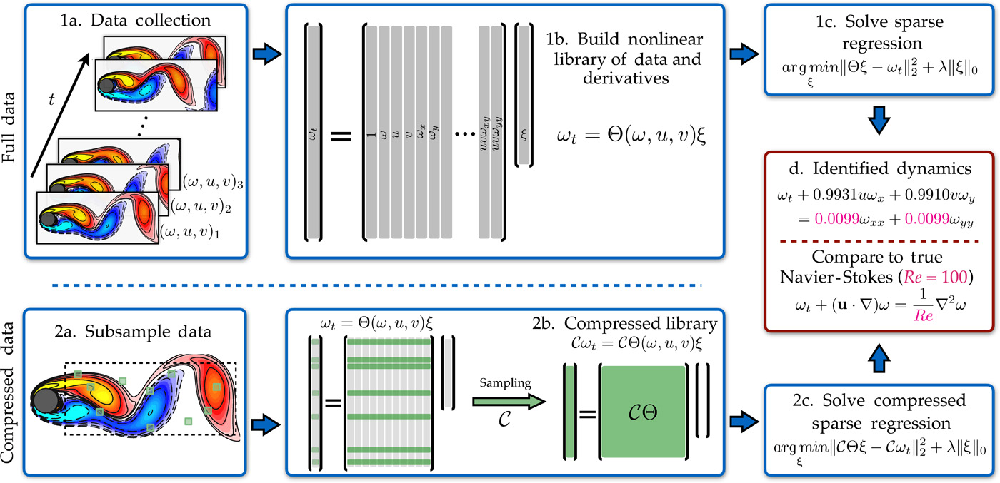

# [Data-driven discovery of partial differential equations](https://www.science.org/doi/10.1126/sciadv.1602614)

## What is the probelm?

There are alot of dynamical systems out there (especially in science) where we can't drive the govering equations (not alone solve them) that describe the system evolution from first princibles (e.g. conservation laws, phsyics principles). We would like to find a way to discover these equations purely from observations.

## What is the solution?

Here they propose to use a sparse regression method to find the terms of the partial differential equation. 

## How?

They create a library (A large matrix) of all possible terms in the PDE up to a certain order derivative as columns, and they use this matrix to find a sparse vector of coeffecient that best descibe the data measurments using sparse regression.

## Technical details

- First you compute the ground truth on the left side, which is the temporal derivative of your spatial coordiantes. This is not always straightforward, especially if your measurment is noisy or has low temporal resolution. It could it be critical for the success of the method. You can always do tricks to reduce noise (e.g. smoothing, removing high frequencies) but again it is difficult to balance the bias-variance tradeoff. Here they used polynomial interploation to calculate the derviative.
- You create your library matrix which contains all the possible combinations of terms in the right side as columns and discritized time as rows. Again to fill in this matrix, you have to compute derviatives. 
- Create a vector of coeffecients of size D that you will learn. 
- Use sparse L1-regulaized regression to find your sparse vector of coeffecients, and hence the right hand terms of the equation. Voila!

## Results

- They that they can recover the Navier stock equation from the data with good accuracy.
- They show that you can use subsamples of the data for training.
- They also show that they can discover severl canonical PDEs including in Lagrangian settings where the sensors are moving with the dynamics.

## Opinions & Takeaways

- It is quite fascinating that you can recover equations that took years to drive, purely from observations.
- Although I have to say, that the data here is obtained from simulations that use these equations for its generation, so it makes sense that a powerful sparse learning algorithm where the finite possible combinations of the terms in the equations is given can learn to approximate these equations.
- I am not a big fan of this manual library creation tirck. What if you have a very high dimensional data. Yes you can do dimensionality reduction (and probably you should) to dicvoer the system modes and apply this framwork on the reduced dimensional
- What if the data doesnot lie in Eucladian manifold? I mean they are still static but they lie on irregular grid. 
- Can we use Neural networks here to learn a low dimeniosnal manifold and do the sparse regression in the latent space to recover the dynamics in terms of latent variables z. What does it then mean? did we recover the equations?
- Do we actually need to dicover the governing equations? Or can we bypass this by just solving for the problem that we want to do use the pde in? I mean just forecasting stratightforward for example. Does it mean that we impliclity learned the underlying pde if we can do accurate forecasting?
- All in all it is a very interesting field and I can see Neural PDEs booming in science in the next few years.

